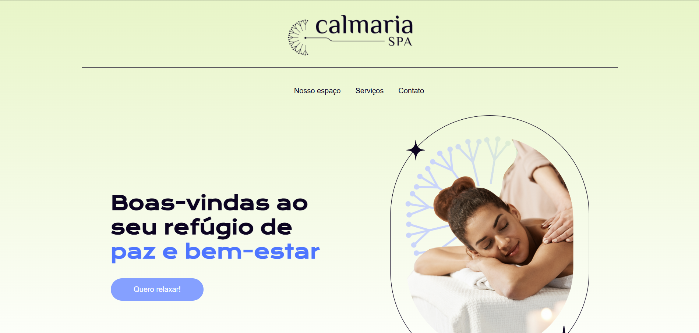

# Calmaria Spa

Projeto fictício de uma página web desenvolvido como exercício prático. O site simula a presença online de um spa chamado **Calmaria**, oferecendo informações sobre o espaço, serviços, promoções e formas de contato.

## 📸 Preview

## 📂 Estrutura do Projeto
assets/  
styles/  
  ├── abstract/  
  ├── components/  
  ├── styles.scss  
  ├── styles.css  
  └── styles.css.map  
index.html

## 🎯 O que foi praticado

Com este projeto pude treinar recursos do pré-processador **SASS**, utilizando:

- **Mixins** — para reutilização de blocos de código;
- **@extend** — para herança de estilos e redução de repetição;
- **Parent Selector (&)** — para melhor organização e escopo dos estilos.

## 🚀 Tecnologias utilizadas

- **HTML5**
- **SASS (SCSS/SASS)**
- **CSS3**

## 📦 Acesse aqui:
link do site: https://calmaria-spa-rouge.vercel.app/
## Desenvolvido com 💻 por Vitor Alcantara
